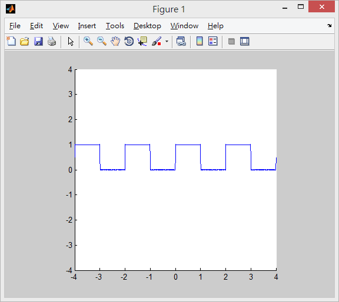
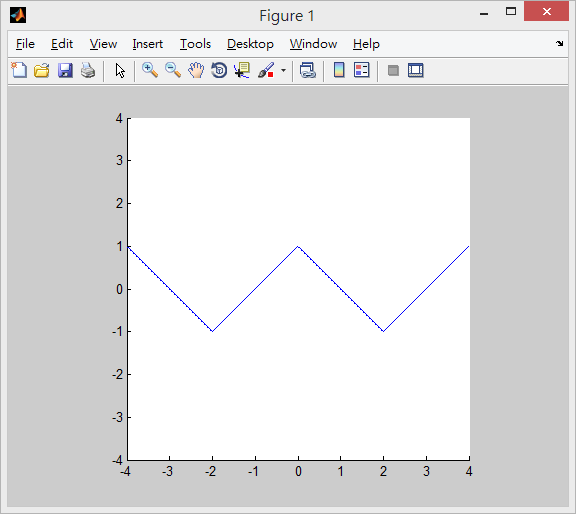
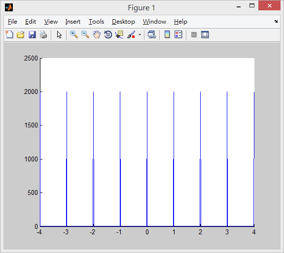

#說明

作業五(1)

#程式碼
```
clear

A = 1;
T0 = 2;
w0 = 2*pi/T0;
c0 = A/2;
t = -4:0.01:4; 
N = 1111;

S = c0*ones(size(t));
for n = -N:2:N,
  cn = (A/2)*(exp(-i*(n/2)*pi)*sinc(n/2));
  S = S + real(cn*exp(i*n*w0*t));
end

hold;
plot(t,S);
axis('equal',[-4,4,-4,4])
```
#截圖



#說明

作業五(2)

#程式碼
```
clear

A = 1;
T0 = 4;
w0 = 2*pi/T0; 
A0 = 0;
t = -4:0.01:4;
N = 1111;

S = A0*ones(size(t));
for n = 1:2:N,
  An = 8/(n*n*pi*pi);
  S = S + An*cos(n*w0*t);
end

hold;
plot(t,S);
axis('equal',[-4,4,-4,4])
```
#截圖



#說明

作業五(3)

#程式碼
```
clear

t = -4:0.01:4;   
S = 1;
for n = 1:1000
  An = cos(n*2*pi*t);
  S = S + An;
end

hold;
plot(t,S);
```
#截圖

